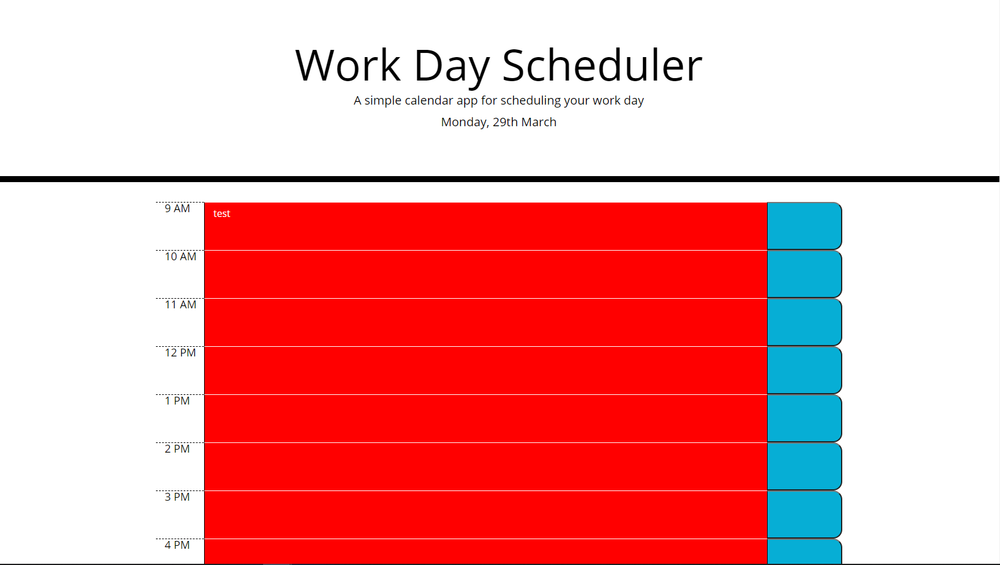

# Overview
The project given was to create a script that makes a daily planner, with the ability to save items between browser refreshes, as well as change colour to show what items are past their time.

## Functionality
The password generator functions as intended, with items saving between browser refreshes, and items changing when their time is passed (however the page does need to be refreshed)

Below is a screenshot of the site taken after 5PM, with test text in the 9AM field.

Website is live at https://frostwrath.github.io/Week-5-Deliverable/